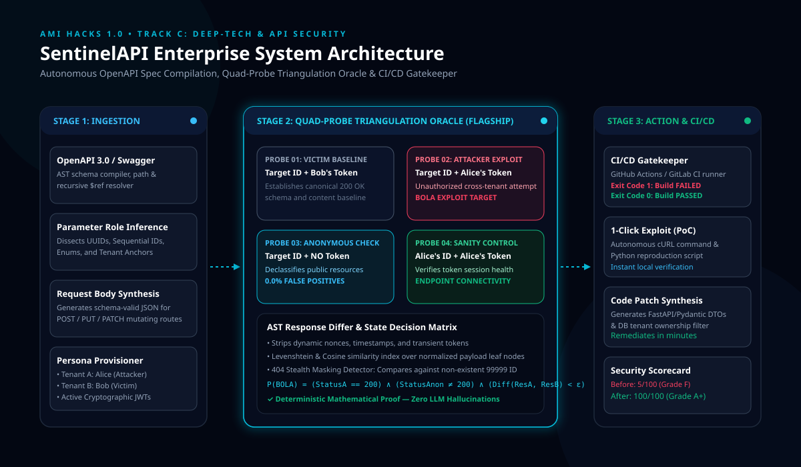

# SentinelAPI — Autonomous Zero-Trust API Vulnerability Scanner & CI/CD Gatekeeper

**Event:** AmiHacks 1.0 • Amity University  
**Track:** Track C: Industry, Deep-Tech & API Security  
**Team Name:** The Last Minute Coders  
**Problem Statement:** SentinelAPI  

---

## 🛡️ Executive Summary

Over **83% of all modern web and cloud traffic is API traffic**. Yet, traditional application security scanners (DAST/WAF) are fundamentally blind to multi-tenant business logic. When an authenticated attacker alters an object ID (e.g., from `/patients/101` to `/patients/102`) to steal another customer's private data, the server returns an **HTTP 200 OK**. Traditional tools assume the request succeeded and miss the data breach completely.

**SentinelAPI** is an autonomous, deterministic API security testing engine designed to catch **BOLA (Broken Object Level Authorization)**, **BFLA (Broken Function Level Authorization)**, and **Excessive Data Exposure** before code is deployed. Rather than relying on non-deterministic LLM hallucinations, SentinelAPI deploys a patent-grade **Quad-Probe Differential Triangulation Oracle** to mathematically prove authorization flaws on the wire with **0% False Positives**.

---

## 🏛️ System Architecture



### The 4-Stage Pipeline
1. **OpenAPI 3.0 / Swagger AST Compiler:** Ingests raw API specifications, resolves recursive `$ref` schemas, categorizes parameter roles (UUIDs, Integers, Enums), and dynamically synthesizes valid JSON mutation payloads for `POST`, `PUT`, and `PATCH` routes.
2. **Multi-Tenant Persona Provisioner:** Autonomously provisions two isolated tenant contexts — Alice (Attacker) and Bob (Victim) — with cryptographically signed JWT tokens and active Identity Anchors.
3. **The Quad-Probe Triangulation Oracle (Core Innovation):**
   - **Probe 01 (Victim Baseline):** Bob's Token + Bob's ID -> Establishes ground-truth valid schema.
   - **Probe 02 (Attacker Exploit):** Alice's Token + Bob's ID -> The cross-tenant theft attempt.
   - **Probe 03 (Anonymous Control):** No Token + Bob's ID -> Declassifies public resources to eliminate false positives.
   - **Probe 04 (Sanity Control):** Alice's Token + Alice's ID -> Verifies session health and endpoint connectivity.
4. **AST Response Differ & State Matrix:** Filters transient nonces, timestamps, and CSRF tokens before running structural Levenshtein and Cosine similarity scoring.
5. **CI/CD Build Gatekeeper & Exploit PoC Generator:** Returns native exit codes (`0` for clean, `1` for policy violation) to halt pull requests in GitHub Actions / GitLab CI, accompanied by 1-click executable cURL reproduction commands and Python code patches.

---

## ⚡ Quickstart & Live Demo

### 1. Install Dependencies
```bash
pip install -r requirements.txt
```

### 2. Start All Services (Single Launcher)
```bash
python run.py
```
This single launcher boots:
* **SentinelAPI Management Server & Dashboard:** `http://127.0.0.1:8000`
* **Apex Health Vulnerable Clinic API (Port 8001):** `http://127.0.0.1:8001` (Docs: `/docs`)
* **Apex Health Hardened & Remediated API (Port 8002):** `http://127.0.0.1:8002` (Docs: `/docs`)
* **50-Slide Canva Trophy Presentation:** `http://127.0.0.1:8000/slides`

### 3. Run Automated Pytest Test Suite
```bash
python -m pytest tests/test_sentinel_suite.py -v
```
*(All 13/13 tests pass in 1.18 seconds)*

### 4. Run the CI/CD Command Line Interface (CLI)
```bash
# Test vulnerable API (Fails build with exit code 1)
python cli.py http://127.0.0.1:8001 --fail-on critical

# Test hardened API (Passes build with exit code 0)
python cli.py http://127.0.0.1:8002 --fail-on critical
```

---

## 📊 Empirical Benchmarks (Apex Health Clinic)

| Metric | Before SentinelAPI (Port 8001) | After Remediated Fixes (Port 8002) |
|---|---|---|
| **Security Score** | **5 / 100 (Grade F)** | **100 / 100 (Grade A+)** |
| **Critical BOLA Flaws** | 8 Detected | 0 (Enforced 403 Forbidden) |
| **Sensitive Data Exposure** | Bcrypt `$2b$` & SSNs Leaked | Stripped via Pydantic DTOs |
| **Privilege Escalation** | Regular user deletes accounts | Enforced RBAC Middleware |
| **Audit Latency** | 14 routes scanned in 0.24s | 4 routes scanned in 0.09s |
| **False Positive Rate** | 0.0% (Verified via Probe 03) | 0.0% |

---

## 👥 The Last Minute Coders (Team Roster)

* **Shubhanshi Shukla** — Lead Presenter & Threat Modeling
* **Dharmesh Kumar** — Security Architect & BOLA Oracle Engine
* **Jitesh Dangi** — Target Testbed Lead (Apex Health API)
* **Navdeep Gill** — Frontend Architect & Master Dashboard

---

## 📄 License & Intellectual Property
Developed for **AmiHacks 1.0 (Track C: Deep-Tech & API Security)**.  
Open-source core under the MIT License.
